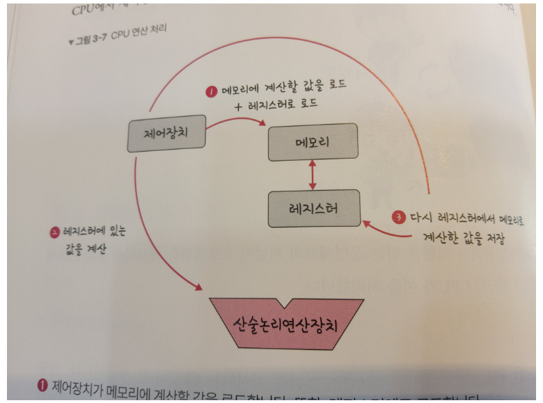
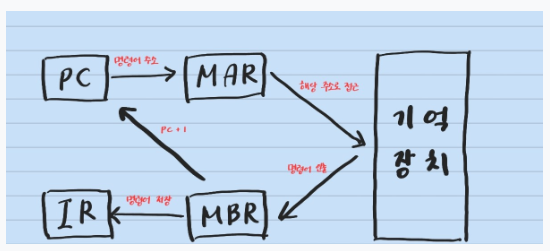

# CPU 작동 원리

- 연산장치, 제어장치, 레지스터 3가지로 구성된다.
- 연산장치 : 연산에 필요한 데이터를 레지스터에서 가져오고, 연산 결과를 다시 레지스터로 보낸다.
- 제어장치 : 명령어를 순서대로 실행할 수 있도록 제어하는 장치
- 레지스터 : 고속 기억장치 명령어 주소, 코드, 연산에 필요한 데이터, 연산 결과 등을 임시로 저장하며 용도에 따라 범용 레지스터와 특수 목적 레지스터로 구분

### **특수 목적 레지스터 중 중요한 것들**

- MAR(메모리 주소 레지스터) : 읽기와 쓰기 연산을 수행할 주기억장치 주소 저장
- PC(프로그램 카운터) : 다음에 수행할 명령어 주소 저장
- IR(명령어 레지스터) : 현재 실행 중인 명령어 저장
- MBR(메모리 버퍼 레지스터) : 주기억장치에서 읽어온 데이터 or 저장할 데이터 임시 저장
- AC(누산기) : 연산 결과 임시 저장

# 예상 질문

## 명령어 처리 과정

**명령어 처리 과정**은 **fetch cycle(인출사이클)** 과 **execute cycle(실행사이클)** 두 개로 나누어 진다.

### **인출 사이클과 실행 사이클에 의한 명령어 처리 과정**

> 인출 사이클에서 가장 중요한 부분은 **PC(프로그램 카운터)** 값 증가
> 
- PC에 저장된 주소를 **MAR(메모리 주소 레지스터)**로 전달
- 저장된 내용을 토대로 주기억장치의 **해당 주소에서 명령어 인출**
- 인출한 명령어를 **MBR(메모리 버퍼 레지스터)**에 저장
- 다음 명령어를 인출하기 위해 **PC (프로그램 카운터)**값 증가시킴
- **메모리 버퍼 레지스터(MBR)**에 저장된 내용을 **명령어 레지스터(IR)**에 전달

`T0 : MAR ← PC`
`T1 : MBR ← M[MAR], PC ← PC+1`
`T2 : IR ← MBR`

인출 사이클이 완료된다.

# 인출한 이후, 명령어를 실행하는 과정**

> ADD addr 명령어 연산
> 

`T0 : MAR ← IR(Addr)`
`T1 : MBR ← M[MAR]`
`T2 : AC ← AC + MBR`

이미 인출이 진행되고 명령어만 실행하면 되기 때문에 **PC(프로그램 카운터)**를 증가할 필요x

**IR(명령어 레지스터)**에 **MBR(메모리 버퍼 레지스터)**의 값이 이미 저장된 상태를 의미함

따라서 AC(누산기)에 **MBR(메모리 버퍼 레지스터)**을 더해주기만 하면 됨

⇒ **데이터를 인출**하고 **데이터 처리** 그리고 처리된 **데이터를 저장**하는 ****과정을 거쳐서 완료됩니다.
