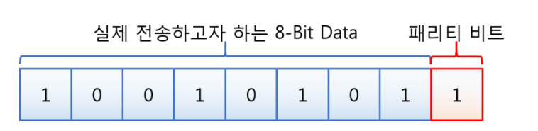
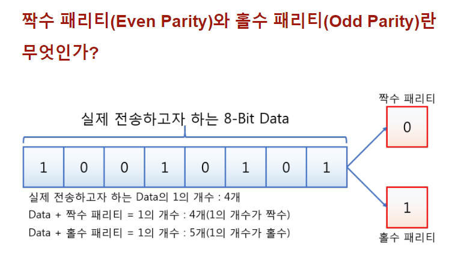
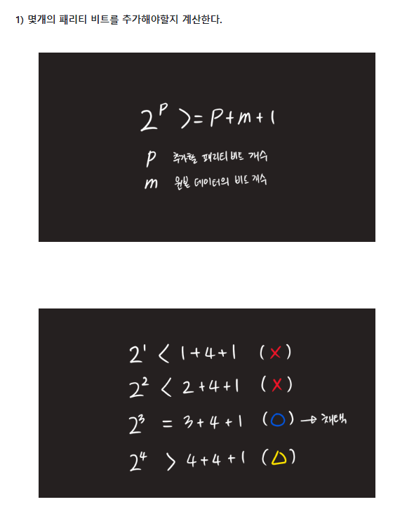
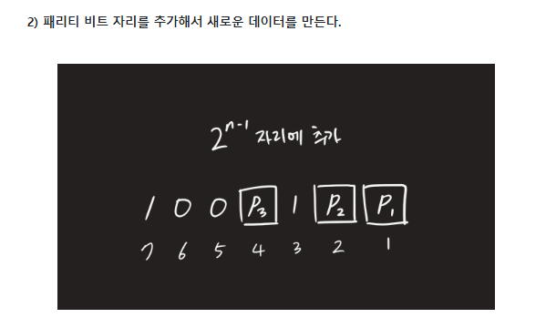

# 패리티 비트 & 해밍 코드

### **패리티 비트**

> 정보 전달 과정에서 오류가 생겼는 지 검사하기 위해 추가하는 비트를 말한다.
> 
> 
> 전송하고자 하는 데이터의 각 문자에 1비트를 더하여 전송한다.
> 
> 오류 검출 및 데이터 재송신 요청만 가능하다.
> 

- 뒤에 추가적으로 붙는 패리티 비트는 짝수 패리티와 홀수 패리티가 있다.

- 데이터 비트에서 1의 개수가 홀수이면 짝수 패리티는 1, 홀수는 0, 위 사진은 데이터 비트에서 1의 개수가 짝수.

### 홀수 짝수 왜 정하는지..?, 패리티 비트를 왜 추가하는 지

⇒ 데이터를 송수신 하는 과정에서 알 수 없는 요인으로 비트의 값이 (하나만)틀어졌을 때 이를 확인할 수 있도록 하기 위함. 

- 수신된 데이터의 전체 비트를 계산하여 패리티 비트를 다시 계산함으로써 데이터 오류 발생 여부를 알 수 있다.
- **단점 : 오류 발생 여부만 알 수 있고, 오류를 수정할 수는 없다.**
- 문제에서는 짝수 패리티인지 홀수 패리티인지 사전에 정하고 나온다.
- 출처 : https://www.happycampus.com/exam-doc/11826300/

### 예시

1. 100을 전송하려고 한다면? 100을 2진법으로 변환한 1100100을 보낸다.
2. 1100100 이란 데이터를 보낼 때 뒤에 1비트를 추가한 8비트를 전송하는데, 뒤에 추가한 1비트를 패리티 비트라고 한다.
3. 11001001 짝수 패리티일 경우 앞의 갚을 전송한다.

### **해밍 코드**

- 해밍 코드를 사용한다면 수신자는 오류 검출 뿐만 아니라 오류 수정까지 가능해진다.

### 해밍 코드 특징

1. 2Bit 오류를 검출할 수 있고, 1Bit 오류를 교정할 수 있다.
2. 데이터 비트 외에 오류 검출 및 교정을 위한 잉여 비트가 많이 필요하다.
3. 해밍 코드 중 1, 2, 4, 8, 16 , ... , 2^n 번째 비트는, 오류 검출을 위한 패리티 비트이다.
4. 패리티 규칙(짝수 or 홀수) 이 정해졌다면, n 번째 패리티 비트는n 번째 비트에서 시작하여, n 비트 만큼을 포함하고, n 비트씩 건너뛴 비트들을 대상으로, 패리티 비트를 결정할 수 있습니다.

### **방법**

2의 n승 번째 자리인 1,2,4번째(2의 0승, 1승, 2승) 자릿수가 패리티 비트이다. 이 숫자로부터 시작하는 세개의 패리티 비트가 짝수인지, 홀수인지 기준으로 판별한다.

### ***짝수 패리티의 해밍 코드가 0011011일때 오류가 수정된 코드는?***

**n 번째 패리티 비트는 n 번째에서 시작하며, n 비트 만틈을 포함하고 n 비트씩 건너뛴 비트들을 대상으로 패리티 비트 범위를 지정하고 각 패리티 비트를 결정한다**

—> 1번일 경우 1, 3, 5, 7

—> 2번일 경우 2,3  6,7

—> 4번일 경우 4,5,6,7

2^n승 자리가 패리티 비트라고 가정.

1. 1, 3, 5, 7번째 비트 확인 : 0101로 짝수이므로 '0'
2. 2, 3, 6, 7번째 비트 확인 : 0111로 홀수이므로 '1'
3. 4, 5, 6, 7번째 비트 확인 : 1011로 홀수이므로 '1'

역순으로 패리티비트 '110'을 도출했다. 10진법으로 바꾸면 '6'으로, 6번째 비트를 수정하면 된다.

따라서 **정답은 00110'0'1**이다.

**n 번째 패리티 비트는 n 번째에서 시작하며, n 비트 만틈을 포함하고 n 비트씩 건너뛴 비트들을 대상으로 패리티 비트 범위를 지정하고 각 패리티 비트를 결정한다**

해밍 코드 참고 사이트 :

위의 사진 출처 : [https://velog.io/@yuseogi0218/패리티-비트-해밍-코드](https://velog.io/@yuseogi0218/%ED%8C%A8%EB%A6%AC%ED%8B%B0-%EB%B9%84%ED%8A%B8-%ED%95%B4%EB%B0%8D-%EC%BD%94%EB%93%9C)

해밍 코드 예제 사이트 : https://wooono.tistory.com/400
