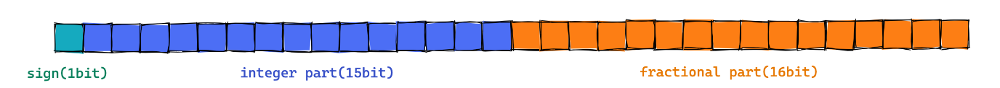
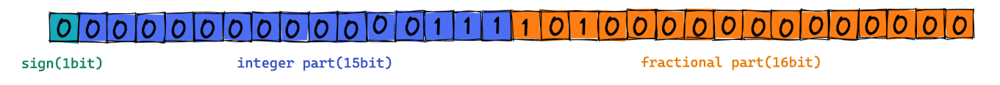
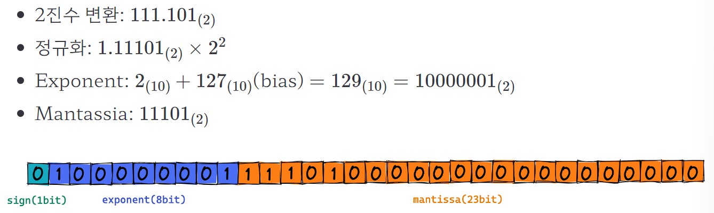

## 들어가기에 앞서 경험해본것들에 대한 이야기

> 먼저 컴퓨터에서 실수를 표현하기 위해 모든 메모리를 다 사용할 수는 없으므로 실수를 표현할 때 사용할 비트의 수를 정해야 한다.

> 데이터분석 프로젝트를 진행하면서 NumPy를 사용할 때, float16, float32, float64와 같은 수 표현 체계 본적 있지?  
> 넘파이에서 실수(float)을 표현할 때 몇 비트를 사용할 것인지를 사용자가 임의로 정하게 해둔 것이라구~

> 예를 들어 float32는 실수를 32비트를 활용해 표현.  
> 그리고 당연하게도 더 많은 비트를 쓸 수록 더 큰 실수를 표현할 수 있지만 그만큼 메모리를 비효율적으로 사용할 가능성이 커진다.

- 이처럼 컴퓨터가 실수를 다루는 두 가지 방법은 **고정 소수점(fixed point)**과 **부동 소수점(floating point)**이 있다.

## 고정 소수점(Fixed Point)

- 원리

  - 고정 소수점(fixed point)은 정수를 표현하는 비트와 소수를 표현하는 비트수(고정)를 미리 정하고 해당 비트만을 활용하여 실수를 표현.

  - 처음 1비트는 sign(부호)을 나타낸다. 양수는 0, 음수는 1이다.
  - 다음 15비트는 integer part(정수부)를 나타낸다.
  - 다음 16비트는 fractional part(소수부)를 나타낸다.
  - 그리고 정수부와 소수부의 경계를 소수점의 위치라고 생각하고 2진수로 변환된 수를 그대로 넣으면 된다.
  - 마지막으로 남는 자리는 모두 0으로 채우면 됩니다.

  

- 예를 들어, 10진수 7.625를 32비트 고정 소수점으로 표현해보자.
- 먼저 10진수 7.625를 2진수로 표현하면:

  

- 이를 32 비트 고정 소수점으로 표현해보면 :

  

## 고정 소수점의 장단점

- 장점 :

  - 고정 소수점 방식은 부동 소수점 방식에 비해서 실수를 표현하는 방법이 단순하고, 속도가 빠르다.

- 단점 :
  - 정수부(interger part)와 소수부(fractional part)에 사용할 비트가 고정되어 있기 때문에 큰 실수를 표현하기 어렵다.
  - 왜? 👉 integer part는 딱 15개의 비트, fractional part는 딱 16개의 비트만 사용 가능!

## 부동 소수점(Floating Point)

- 원리

  - 부동 소수점 표현 방식은 ‘움직이지 않는다’라는 부동(不動)으로 오해하기 쉽다. 그러나 여기서 부동은 움직이지 않는다는 뜻이 아니라 **_떠다닌다, 부유하다의 의미를 가지는 부동(浮動)_**이다. 단어에서 유추를 해보면, 소수점이 옮겨다니는 방식의 실수 표현법이라고 이해하면 쉽다.

  - 부동 소수점 표현 방식은 고정 소수점 표현 방식과 비트를 사용하는 체계가 다르다. 그리고 부동 소수점은 이를 표현하는 다양한 체계가 있는데, 일반적으로 가장 널리 쓰이는 표준은 IEEE 754이다.
  - IEEE 754에 대한 자세한 설명은 아래에 따로 분리해둠.

  - 2진수를 정규화(normalize). 👉 1.XXX \* 2^N 형태로 나타내는 것 (이진수)
  - 처음 1비트는 sign(부호)를 나타낸다 (0은 양수, 1은 음수).
  - 다음 8비트는 exponent(지수부)를 나타낸다. 정규화 과정에서 얻어낸 지수에 bias를 더한 값으로 채운다.
  - 다음 23비트는 mantissa(가수부)를 나타낸다. 소수 부분의 값으로 채우는 부분.

  

## 부동소수점 원리에 대한 자세한 설명

### 1. 정규화

- 컴퓨터 공학에서 정규화란 이진수를 1.XXX \* 2 ^ N 형태로 나타내는 것이다.
- 7.625 라는 십진수를 이진수로 변환하면 111.101로 변환된다.
- 111.101을 정규화하면, 1.11101 \* 2 ^ 2 로 표현할 수 있다.
- 지수(exponent) = 2

### 2. Exponent & Bias

- 지수부에 2를 바로 채우는 것이 아니라, IEEE 754 표준에서는 32비트로 실수를 표현할 때는 127(십진수)이라는 bias를 더한 값으로 채우라고 명시하고 있다. 즉 129 (127 + 2)을 2진수로 변환한 값인 10000001 를 채운다.

- Why ? 👉 지수가 음수일 경우에 대처하기 위해서!
- 예를 들어 0.000101 이라는 이진수를 정규화하면 1.01 \* 2 ^ -4 라는 값을 얻게 된다.
- 여기서 지수는 -4 가 나온다.

### 음수 표현 아이디어

    1. 가장 간단한 아이디어는 전체 수가 양수인지 음수인지를 나타내는 sign 값에 1 비트를 할당하는 것과 같은 원리로 지수가 음수인 것을 나타내기 위해 1 비트를 사용하는 것이다. 그러나 이경우 표현할 수 있는 수의 범위가 작아진다는 아주 큰 단점이 있습니다. (-127 ~ 128)

    2. IEEE 754 표준에서는 8 비트로 음수와 양수 모두를 표현하기 위한 하나의 장치로 bias 라는 값을 설정함. 이를 통해 exponent 부분은 항상 unsigned(0과 양수) 값만 가지게 셋팅을 하게 된다. 8bit는 256개의 숫자를 표현 할 수 있으므로 unsinged 값의 범위는 10진수 0~255가 된다.

    3. 참고로 0과 255 는 각각 0과 무한대르 등을 나타내기 위해 특별히 할당된 숫자이기 때문에 정규화 방법이 적용되지 않는다!

### 3. 가수부(mantassia)

    - mantassia는 고정 소수점에서의 fractional part(소수부)와 같은 역할. 정규화 결과의 소수 부분을 mantassia 자리에 그대로 넣고, 남는 자리는 0으로 채우면 된다.

- 십진수 7.625 부동 소수점 표현

## 부동 소수점의 장단점

- 장점 :

  - 부동 소수점은 고정 소수점에 비해서 더 큰 실수를 표현할 수 있다.

  - 부동 소수점에서 무한대의 수를 표현하는 255를 제외하고 실질적으로 가장 큰 숫자는 254이다.

  - 254에는 bias 127이 더해져 있다.  
    따라서 정규화 결과로 가질 수 있는 가장 큰 지수는 127이다.

  - 따라서 32비트 부동 소수점에서 가질 수 있는 가장 큰 수의 정규화 결과는 1.xxx \* 2 ^ 127 와 같은 형태.

  - 정규화 이전의 값을 떠올려 보면 고정 소수점에 비해서 정수 자리에 훨씬 더 많은 비트를 할당할 수 있음을 알 수 있습니다. (15 -> 127)

- 단점 :
  - 실수 연산이 부정확할 수 있다는 것이 부동 소수점 표현 방식의 가장 큰 단점.
  - 예를 들어 십진수 0.3을 2진수로 변환하면 0. 0100110011001... 처럼 특성 수가 무한이 반복된다.  
    따라서 컴퓨터가 실수 부분을 표현할 수 있는 비트수를 다 써버리게 되어 근사치로 표현된다.
