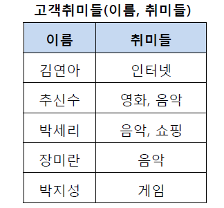
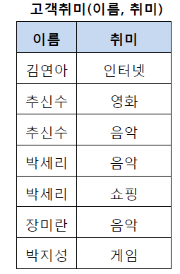
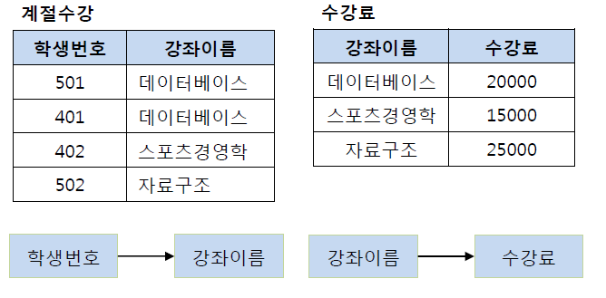

## 정규화

- 관계형 데이터 모델 에서 **데이터의 중복성을 제거**하여 **이상 현상을 방지**하고, 데이터의 일관성과 정확성을 유지하기 위해 무손실 분해하는 과정

## 정규화의 목적

1. 중복 데이터를 최소화하여 테이블 불일치 위험을 최소화한다.

2. 수정, 삭제 시 이상 현상을 방지함으로써 데이터 구조의 일관성을 최대화한다.

3. 데이터 삽입 시 릴레이션의 재구성에 대한 필요성을 줄인다.

4. 효과적인 검색 알고리즘을 생성할 수 있다.

## 이상현상(Anomaly)의 종류

1. 삭제 이상 : 데이터 삭제 시 의도와는 상관없이 다른 정보까지 연쇄적으로 삭제되는 현상

2. 삽입 이상 : 데이터 삽입 시 의도와는 상관없이 원하지 않는 값들도 함께 삽입되는 현상

3. 수정 이상 : 데이터 수정 시 의도와는 상관없이 데이터의 일부만 수정되어 일어나는 데이터 불일치 현상

## 정규화 절차

1. 제1정규화 : 속성(Attribute)의 원자성을 확보하고 원자값이 아닌 도메인을 분해한다.
2. 제2정규화 : 기본키가 2개 이상의 속성으로 이루어진 경우, 부분 함수 종속성을 제거(분해)한다.
3. 제3정규화 : 기본키를 제외한 컬럼간의 종속성을 제거한다. 즉 이행 함수 종속성을 제거한다.
4. BCNF : 기본키를 제외하고 후보키가 있는 경우 후보키가 기본키를 종속시키면 분해한다.
5. 제4정규화 : 여러 컬럼들이 하나의 컬럼을 종속시키는 경우 분해하여 다중값 종속성을 제거한다.
6. 제5정규화 : 조인에 의해서 종속성이 발생하는 경우 분해한다.

### 실질적으로 제 3 정규화까지 진행!

## 제1정규화(1NF)

- 제1 정규화란 테이블의 컬럼이 원자값(Atomic Value, 하나의 값)을 갖도록 테이블을 분해하는 것이다.

> 1. 위의 테이블에서 추신수와 박세리는 여러 개의 취미를 가지고 있기 때문에 제1 정규형을 만족하지 못하고 있다.

> 2. 그렇기 때문에 이를 제1 정규화하여 분해할 수 있다.

## 제 2 정규화(2NF)

- 제2 정규화란 제1 정규화를 진행한 테이블에 대해 완전 함수 종속을 만족하도록 테이블을 분해하는 것이다.
- 여기서 완전 함수 종속이라는 것은 기본키의 부분집합이 결정자가 되어선 안된다는 것을 의미한다.

> 1. 이 테이블에서 기본키는 (학생번호, 강좌이름)으로 복합키이다.

> 2. 그리고 (학생번호, 강좌이름)인 기본키는 성적을 결정하고 있다.

> 3. (학생번호, 강좌이름) 👉 (성적)  
>    그런데 여기서 강의실이라는 컬럼은 기본키의 부분집합인 강좌이름에 의해 결정될 수 있다.

> 4. (강좌이름) 👉 (강의실)  
>    즉, 기본키(학생번호, 강좌이름)의 부분키인 강좌이름이 결정자이기 때문에 위의 테이블의 경우 다음과 같이 기존의 테이블에서 강의실을 분해하여 별도의 테이블로 관리하여 제2 정규형을 만족시킬 수 있다.

## 제 3 정규화 (3NF)

- 제3 정규화란 제2 정규화를 진행한 테이블에 대해 이행적 종속을 없애도록 테이블을 분해하는 것이다.

- **이행적 종속** :  A -> B,  B -> C가 성립할 때 A -> C가 성립되는 것을 의미한다.

> 1. 기존의 테이블에서 학생 번호는 강좌 이름을 결정하고 있고, 강좌 이름은 수강료를 결정하고 있다.

> 2. 그렇기 때문에 이를 (학생 번호, 강좌 이름) 테이블과 (강좌 이름, 수강료) 테이블로 분해해야 한다.

> **이행적 종속을 제거하는 이유**
>
> - 예를 들어 501번 학생이 수강하는 강좌가 스포츠경영학으로 변경되었다고 하자.
> - 이행적 종속이 존재한다면 501번의 학생은 스포츠경영학이라는 수업을 20000원이라는 수강료로 듣게 된다.
> - 물론 강좌 이름에 맞게 수강료를 다시 변경할 수 있지만, 이러한 번거로움을 해결하기 위해 제3 정규화를 하는 것이다.
> - 즉, 학생 번호를 통해 강좌 이름을 참조하고, 강좌 이름으로 수강료를 참조하도록 테이블을 분해한다.

