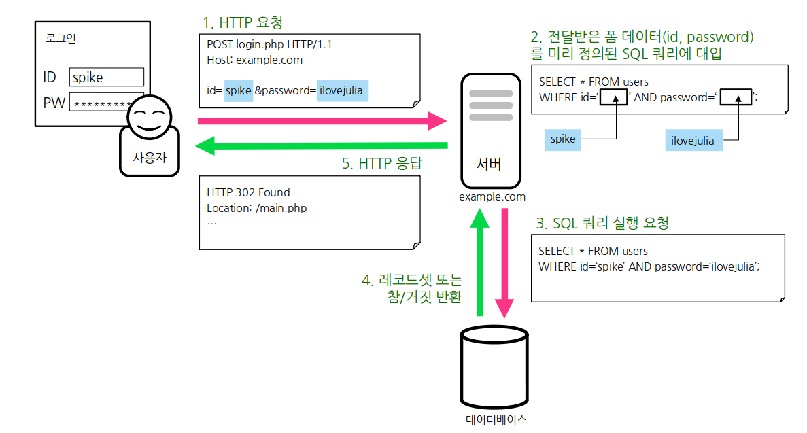
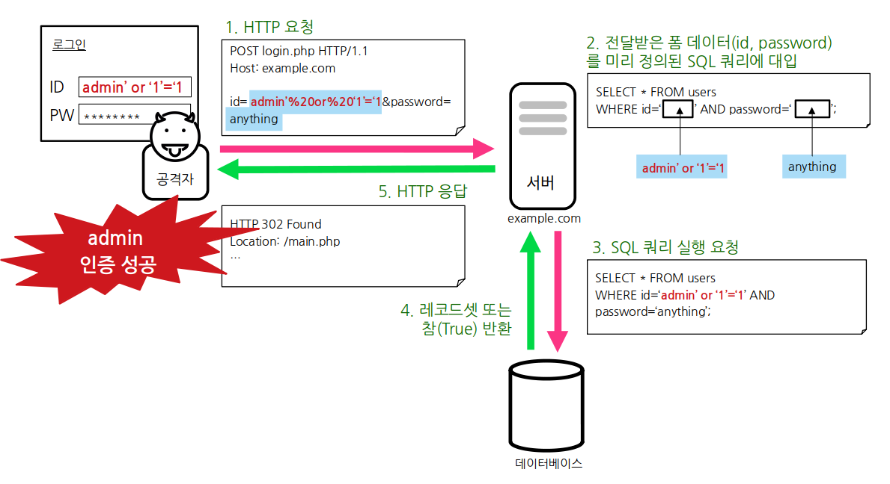

## SQL Injection

- SQL Injection(SQL 주입)은 웹 애플리케이션이 백엔드에서 구동 중인 데이터베이스에 접근 하는 과정에 사용되는 SQL 쿼리를 조작하여 데이터베이스를 대상으로 공격자가 의도한 악의적인 행위를 할 수 있는 Injection 기반의 웹 취약점이다.

- 공격자가 SQL Injection 공격에 성공하게 되면 조직 내부의 민감한 데이터나 개인 정보를 획득할 수 있으며, 심각한 경우에는 조직의 데이터 전체를 장악하거나 완전히 손상시킬 수 있다.

## SQL Injection 동작 원리

### 정상적인 로그인 요청 수행 과정

      1. 사용자가 웹 애플리케이션에서 데이터베이스와 연동된 기능을 사용할 때 사용자에 의해 입력된 데이터(또는 웹 애플리케이션에 의해 셋팅된 데이터)는 HTTP 요청(GET 매개변수 또는 POST Body 매개변수 등)을 통해 웹 애플리케이션으로 전송

      2. 전송된 데이터는 서버측 스크립트에 의해 미리 정의 및 저장되어있던 SQL 쿼리 안의 지정된 위치로 대입

      3. 서버측 스크립트는 데이터베이스에 완성된 SQL 쿼리 실행을 요청

      4. 데이터베이스는 SQL 쿼리를 실행한 후 조건에 부합하는 레코드셋이나 Boolean 값(참/거짓) 또는 오류를 반환

      5. 서버측 스크립트는 데이터베이스에서 반환된 데이터에 맞게 HTTP 응답 메시지를 만들어 사용자에게 회신

### SQL Injection 공격 과정

    

## SQL Injection 공격 유형

### 1. 오류(Error) 기반 SQL Injection

- 잘못된 문법이나 자료형 불일치 등에 의해 웹 브라우저에 표시되는 데이터베이스 오류를 기반으로 수행되는 공격 기법이다.

- 공격자는 의도적인 오류를 유발시키고 해당 오류 정보를 바탕으로 데이터베이스명, 테이블, 컬럼 정보 등을 파악할 수 있게 된다.

### 2. UNION 기반 SQL Injection

- 공격자가 의도한 SQL 쿼리를 UNION 연산자를 이용하여 기존 SQL 쿼리에 덧붙이고 기존 SQL을 무효화시켜 원하는 내부 데이터를 절취할 수 있는 공격 기법

### 3. Blind SQL Injection

- 웹 브라우저 화면상에 데이터베이스 오류 정보나 데이터가 직접적으로 노출되지 않을 때 이용되는 기법으로 공격자가 육안으로 확인할 수 있는 데이터베이스 오류나 데이터가 없다는 점에 착안되어 Blind SQL Injection 혹은 추론 기반 SQL Injection이라고 불린다.

- 공격자는 공격이 성공했는지 판단하기 위해 미세한 서버의 응답과 동작 방식까지 관찰하고 공격 성공의 단서로서 활용한다.

  1. Boolean 기반

  - SQL 쿼리의 결과가 참 또는 거짓이냐에 따라 웹 애플리케이션의 응답이 다른 경우 사용된다.
  - 오로지 참/거짓만을 판단할 수 있는 서버의 응답만으로 공격을 수행하므로 공격자는 논리적으로 문제가 없는 공격 쿼리를 작성하기 위해 많은 시간과 노력이 필요 → 고수의 방법

   

  2. Time 기반

  - SQL 쿼리의 결과가 참 또는 거짓이냐에 따라 서버의 응답 시간을 제어할 수 있을 때 사용된다.

  - MySQL의 Sleep(5000);와 같이 밀리초의 단위의 시간 동안 대기하는 SQL 명령을 사용해 공격의 성공 여부를 판단한다.

  - 공격자가 지정한 시간만큼 응답이 지연된다면 SQL Injection에 취약한 것으로 간주할 수 있습니다.

## SQL Injection 예방

### 1. 입력값 검사

- HTTP 요청을 통해 전달되는 사용자 데이터에 SQL 구문으로 해석될 수 있는 문자 또는 공격에 사용되는 SQL 구문들의 포함여부를 검사하고 포함시 요청을 차단하거나 해당 문자를 제거(또는 다른 문자로 대체)하는 방법.

- 일부 SQL Injection 공격에 대해서는 효과가 있지만 이 방법에만 의존해서는 SQL Injection 공격을 안전하게 방어할 수 없다.

> **SQL 기호** : 홑따옴표('), 겹따옴표("), 세미콜론(;), 대시(-), 샵(#), 슬래시샵 (/\*) 등
>
> **SQL 구문** : SELECT, INSERT, UPDATE, DELETE, UNION, GROUP BY, HAVING, ORDER BY 등

### 2. SQL 서버 오류 발생 시, 해당하는 에러 메시지 감추기

- 공격자가 SQL Injection을 수행하기 위해서는 데이터베이스의 정보(테이블명, 컬럼명 등)가 필요하다.

- 데이터베이스 에러 발생 시 따로 처리를 해주지 않았다면, 에러가 발생한 쿼리문과 함께 에러에 관한 내용을 반환해 주게 된다.

- **여기서** 테이블명 및 컬럼명 그리고 쿼리문이 노출이 될 수 있기 때문에, 데이터 베이스에 대한 오류발생 시 사용자에게 보여줄 수 있는 페이지를 제작 혹은 메시지박스를 띄우도록 하여야 합니다.

### 3. 매개변수화된 쿼리 적용

- 데이터베이스에서 사용되는 동일하거나 유사한 SQL 쿼리를 효율적으로 반복적으로 실행하기 위해 사용되는 기능.

- 쉽게 말해서 매개변수화된 쿼리는 자주 사용되는 SQL 쿼리를 데이터베이스에 준비해두었다가, 해당 SQL 쿼리 실행에 필요한 값들만 매개변수로 전달하여 실행하는 방식.

- 매개변수화된 쿼리를 사용하면 공격자는 SQL 쿼리의 구조를 알 수 없고, 어떤 HTTP 매개변수가 SQL 쿼리의 어느 부분에 전달되는지 알지 못하므로 SQL Injection 방어에 유용하게 활용될 수 있다.
