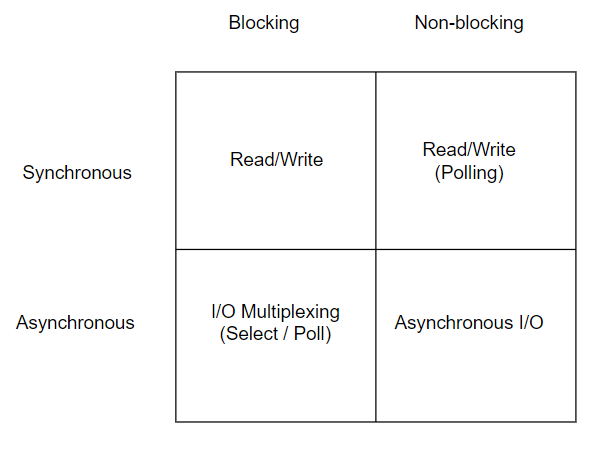
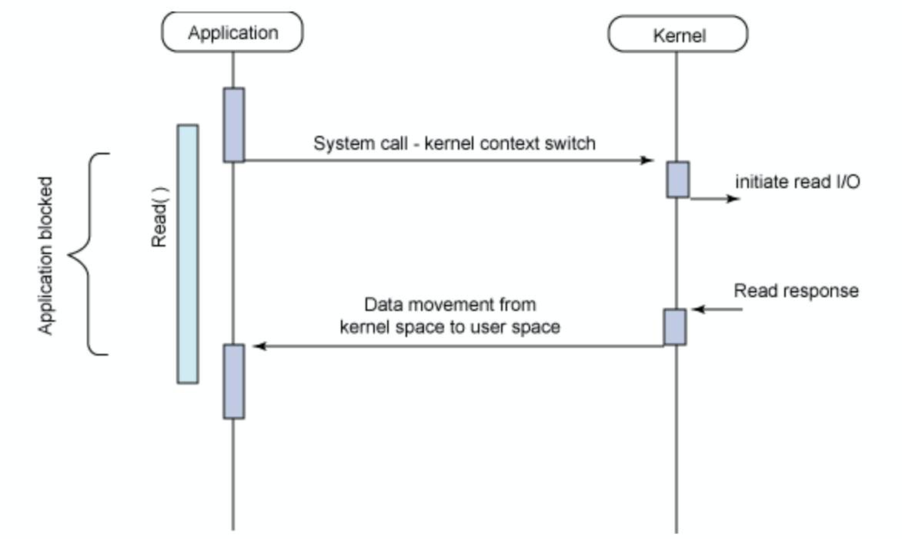
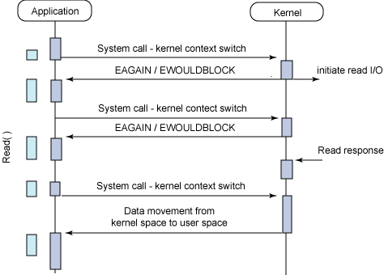
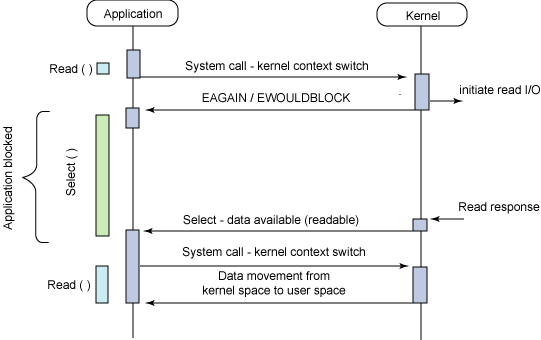
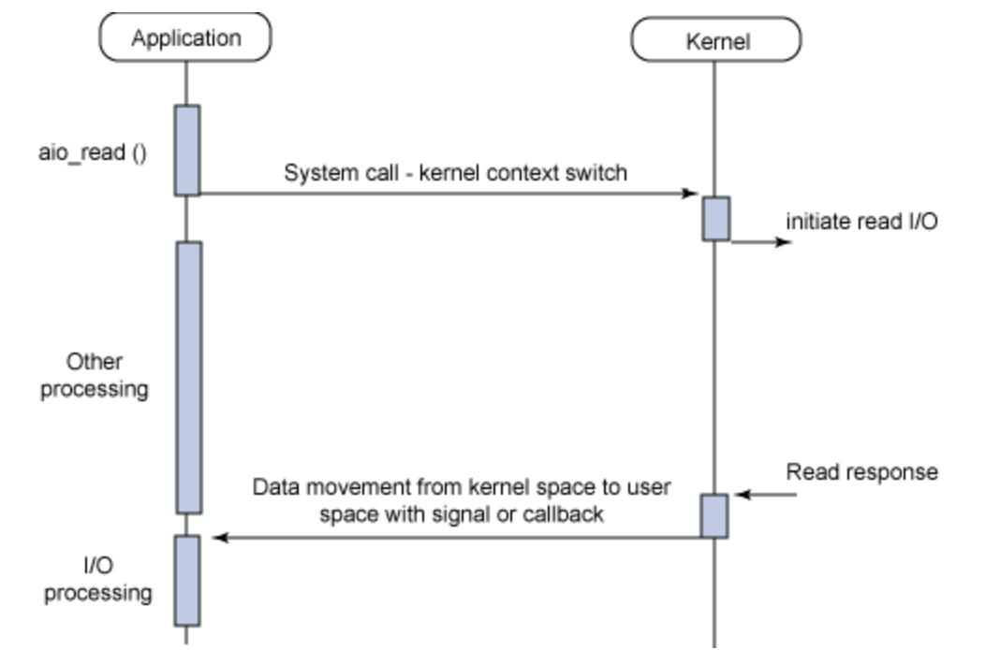
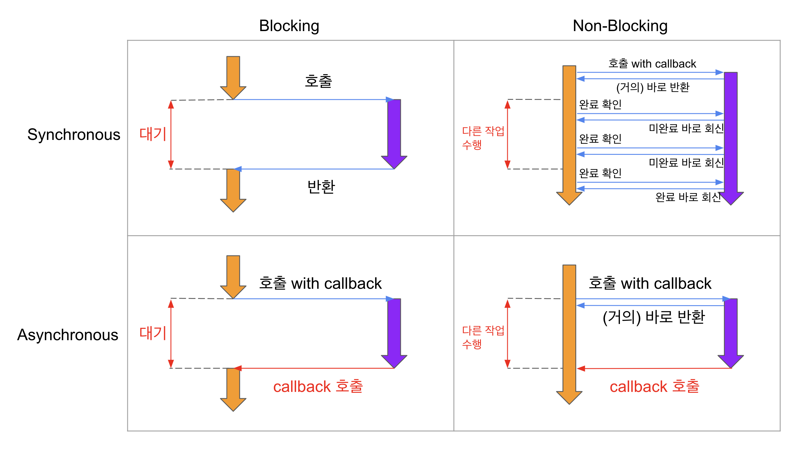

## I/O model

## Synchronous Blocking I/O (동기식 블로킹 입출력)

가장 일반적인 모델인 동기식 블로킹 I/O 모델이다.
이 모델은 응용 프로그램에서 read, accept 같은 시스템 호출 함수를 사용한다면, 시스템 호출이 완료될 때까지(응용 프로그램의 버퍼에 데이터가 수신되기 전까지) 프로세스는 자신의 작업을 중지하고 해당 함수에서 대기한다.

즉, 여러 클라이언트가 접속하는 서버를 이 모델로 구성할 경우 클라이언트 별 프로세스가 준비되어야 하며 클라이언트 수의 증가는 곧 thread 수의 증가를 의미한다.

- sync: 작업이 완료되면 해당 작업 결과를 가지고 어플리케이션에서 직접 처리한다.

- blocking I/O: I/O 호출이 발생했을 때 커널의 I/O 작업이 완료될 때까지 제어권을 커널에서 가지고 있어, User Process는 I/O가 완료되기 전에 다른 작업을 할 수 없다.

## Synchronous Non-Blocking I/O (동기식 비 블로킹 입출력)

가장 비효율적인 방식의 동기식 비 블로킹 I/O 방식이다.
이 방식은 I/O를 상태를 체크하여 완료하지 못했다면 오류(EAGAIN, EWOULDBLOCK)를 반환하여 다시 호출해야 함을 알린다.

I/O이 완료될때 까지 계속해서 read, accept같은 함수를 호출하여 I/O를 완료할 수 있는 상태가 되었나 검사를 진행한다.

이렇게 지속적으로 상태를 체크하는 방식을 Polling이라고 한다. Blocking에 대한 대기가 없어 다른 작업을 수행할 수 있지만 필요이상으로 CPU자원이 낭비된다는 점과 I/O의 지연시간을 초래할 수 있다는 단점이 있다.

- sync: 다른 작업을 수행하다 중간중간 system call을 보내 I/O 작업이 완료됐는지 커널에게 지속적으로 물어본다.  
  그리고 I/O 작업이 처리되었을 때 결과를 호출한 함수에서 처리한다.  
  직접 결과를 처리해야 하기 때문에 지속적으로 I/O 종료를 물어보는 것이다.

- non-blocking: I/O 호출이 발생했을 때 커널의 I/O 작업 완료 여부와 관계없이 즉시 응답한다.  
  커널이 system call을 받자마자 제어권을 다시 어플리케이션에 넘겨주기 때문에 User Process가 I/O가 완료되기 전에 다른 작업을 할 수 있다.

## Asynchronous Blocking I/O (비동기식 블로킹 I/O)

Async Blocking I/O는 I/O 작업을 호출을 할 때 callback을 같이 넘겨주면서, I/O 작업이 종료됐을 때 어플리케이션에 해당하는 callback 함수가 호출되는 방식이지만 실질적으로 I/O 로직이 처리될 때까지 어플리케이션이 block되는 경우를 의미한다.

좀 더 명확히 구분하지면 I/O 작업 자체에 의해 block되는 것이 아니라 system call에 대한 커널의 응답이 block된다고 할 수 있다. 첫 요청에 대해서는 즉각 미완료 상태를 반환하는 non-blocking의 동작을 보여주기 때문이다.

의도적으로 이 모델을 쓰는 경우는 거의 없다고 할 수 있고, Async Non-Blocking I/O 방식을 사용하는데 그 과정 중에 하나가 Blocking 방식으로 동작하는 경우 Async Blocking I/O 으로 동작할 수 있다.

이러한 Async Blocking I/O의 대표적인 케이스가 Node.js와 MySQL의 조합이라고 한다.

Node.js 쪽에서 callback 통해 Async로 동작해도, 결국 DB 작업 호출 시에는 MySQL에서 제공하는 드라이버를 호출하게 된다.
그런데 이 드라이버가 Blocking 방식이라고 한다.

- async: 작업이 완료되면 해당 작업 결과를 가지고 어플리케이션에서 호출한 함수가 직접 처리하는게 아니라 callback을 넘기면서 callback 함수 호출을 통해 작업 결과를 처리한다.

- blocking I/O: I/O 호출이 발생했을 때 커널의 I/O 작업이 완료될 때까지 제어권을 커널에서 가지고 있기 때문에 User Process는 I/O가 완료 되기 전에 다른 작업을 할 수 없다.

## Asynchronous Non-Blocking I/O (비 동기식 비 블로킹 I/O)

응용프로그램이 백그라운드 작업이 완료되는 동안 다른 프로세스를 수행할 수 있다.
즉, I/O 호출을 했을 때 첫 요청에 대해서는 미완료 상태를 반환한다. (여기까지 동기 논블로킹과 일치) 이 후 다른 프로세스를 수행하다가 준비가 완료되었다는 신호를 받게 되면 그 때 I/O를 처리합니다.

- async: I/O 처리는 백그라운드에서 실행되다가 완료되면 커널이 User Process에게 작업 완료 시그널을 보내거나 callback을 보낸다.  
  즉, I/O가 완료되면 그 때 커널이 User Process에게 알려주는 방식이다.

- non-blocking I/O: I/O 호출이 발생했을 때 system call이 들어오면 커널의 I/O 작업 완료 여부와 관계없이 즉시 응답한다.  
  따라서 User Process는 I/O가 완료되기 전에 다른 작업을 할 수 있다.

## 요약

- Blocking/NonBlocking I/O는 호출되는 함수가 바로 리턴하느냐 마느냐가 관심사이다.

- Synchronous/Asynchronous는 호출되는 함수의 작업 완료 여부를 누가 신경쓰냐가 관심사다.
