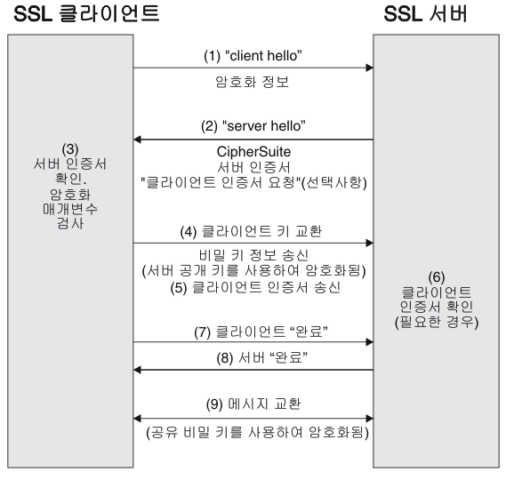

## SSL/TLS 가 뭐야 ❓

> SSL(Secure Sockets Layer)은 보안 프로토콜로서, 개인정보 보호, 인증, 무결성 을 인터넷 통신에 제공한다.  
> SSL 이란 명칭은 TLS(Transport Layer Security)로 발전했다.  
> SSL/TLS 를 사용하는 웹사이트의 URL에는 "HTTP" 대신 "HTTPS" 가 있다.

> 클라이언트가 접속한 서버가 신뢰 할 수 있는 서버인지를 판단하고 SSL 통신에 사용될 공개키를 클라이언트에게 전달하는 것  
> 포함내용 : 서비스의 정보(CA, 도메인), 서버측 공개키

- SSL 이 발전되어 TLS 이라는 용어로 변경되었지만 SSL 의 인지도가 크기 때문에 현재까지 TLS 도 SSL 로 부르며 사용한다고 한다.
- 소유권 변경을 위해 TLS 라는 이름으로 변경 되었을 뿐 SSL 의 최종 버전(3.0) 과 TLS 첫 버전의 차이는 크지 않다.

## Handshakes

> Handshake 란 Client 와 Server 간의 대화를 뜻한다. 연결적 요소라고 생각하면 된다.  
> TCP 에서 Server 와 연결할 때의 3-way handshake, 해제할 때의 4-way handshake 가 있다.  
> Server 의 SSL 인증서, 공개키, Client 의 비밀키 를 교환하는 TLS Handshake 가 있다.  
> TLS Handshake 는 암호화를 하는 일련의 과정!

## 대화형으로 설명하는 TLS Handshake 과정

- Client : 안녕하세요 ! 안전한 통신을 구축하고 싶습니다. 여기 제 TLS 버전 과 제가 알고있는 여러가지 암호알고리즘 이 있습니다. -> **ClientHello**

- Server : 네 안녕하세요. 귀하의 암호 알고리즘들과 TLS 버전 을 확인했습니다.  
  음...귀하가 갖고있는 알고리즘에서 이 알고리즘을 사용하는 것이 좋을 것 같군요  
  ( Client 가 제시한 알고리즘 중 하나 선택 ) -> **ServerHello**

- Server : 여기 제가 갖고있는 SSL 인증서에 제 공개키 를 써서 드리겠습니다. -> **Certificate**

- Server : ( SSL 인증서에 자신의 공개키가 없을 때 ) 아차 ! 제 공개 키를 깜빡했군요.  
  여기 제 공개 키 입니다 ( Server 가 Client 에게 직접 공개키 전달 / 만약 SSL 인증서에 자신의 공개 키가 들어있다면 이 구간은 생략한다 ) -> **ServerHello Done (Server Key Exchange)**

- Client : 내가 갖고있던 CA(인증기관)공개 키 로 Server 가 보내준 SSL 인증서 를 열어봐야겠다( CA 의 공개키로 복호화 가 성공했다면 이 SSL 인증서 는 CA 가 서명한 것이 맞는 셈이다 ).  
  이제 저와 당신만의 비밀 키 ( 공유 비밀 키 ) 를 생성하고, 이 비밀 키 를 당신이 준 공개키로 암호화 해서 보낼게요! -> **ClientKeyExchange**

- 이제 Server 는 자신의 비밀 키 로 Client 가 보내준 공유 비밀 키를 복호화해서 열어본다.  
  그 후 Client, Server 서로가 교환할 정보를 모두 교환한 뒤 통신할 준비가 다 되었음을 알리는 **ChangeCipherSpec** 패킷을 보낸 뒤 Finished 패킷을 보내며 TLS Handshake 를 종료합니다

### CA ❓

- SSL인증서를 기준으로 클라이언트가 접속한 서버가 클라이언트가 의도한 서버가 맞는지를 확인을 하게 된다.  
  이러한 일을 해주는 공인된 회사들을 CA라고 한다.  
  이러한 CA는 브라우저가 리스트를 가지고 있고 이 CA들의 공개키들을 가지고 있다.

### 면접질문 LIST

1.  대칭키
2.  비대칭키
3.  SSL Handshake 과정을 그림을 통해 설명
    - 자세한 용어까지는 알지 못해도 그림으로라도 설명!

### 참고사항 - 자세한 진행과정

1. 클라이언트는 서버에게 client hello 메시지를 담아 서버로 보낸다. 이때 암호화된 정보를 함께 담는데, 버전, 암호 알고리즘, 압축 방식 등을 담는다.

2. 서버는 클라이언트가 보낸 암호 알고리즘과 압축 방식을 받고, 세션 ID와 CA 공개 인증서를 server hello 메시지와 함께 담아 응답한다. 이 CA 인증서에는 앞으로 통신 이후 사용할 대칭키가 생성되기 전, 클라이언트에서 handshake 과정 속 암호화에 사용할 공개키를 담고 있다.

3. 클라이언트 측은 서버에서 보낸 CA 인증서에 대해 유효한 지 CA 목록에서 확인하는 과정을 진행한다.

4. CA 인증서에 대한 신뢰성이 확보되었다면, 클라이언트는 난수 바이트를 생성하여 서버의 공개키로 암호화한다. 이 난수 바이트는 대칭키를 정하는데 사용이 되고, 앞으로 서로 메시지를 통신할 때 암호화하는데 사용된다.

5. 만약 2번 단계에서 서버가 클라이언트 인증서를 함께 요구했다면, 클라이언트의 인증서와 클라이언트의 개인키로 암호화된 임의의 바이트 문자열을 함께 보내준다.

6. 서버는 클라이언트의 인증서를 확인 후, 난수 바이트를 자신의 개인키로 복호화 후 대칭 마스터 키 생성에 활용한다.

7. 클라이언트는 handshake 과정이 완료되었다는 finished 메시지를 서버에 보내면서, 지금까지 보낸 교환 내역들을 해싱 후 그 값을 대칭키로 암호화하여 같이 담아 보내준다.

8. 서버도 동일하게 교환 내용들을 해싱한 뒤 클라이언트에서 보내준 값과 일치하는 지 확인한다. 일치하면 서버도 마찬가지로 finished 메시지를 이번에 만든 대칭키로 암호화하여 보낸다.

9. 클라이언트는 해당 메시지를 대칭키로 복호화하여 서로 통신이 가능한 신뢰받은 사용자란 걸 인지하고, 앞으로 클라이언트와 서버는 해당 대칭키로 데이터를 주고받을 수 있게 된다.
