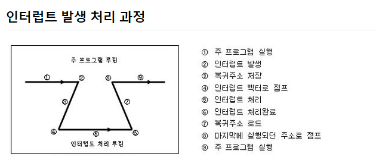
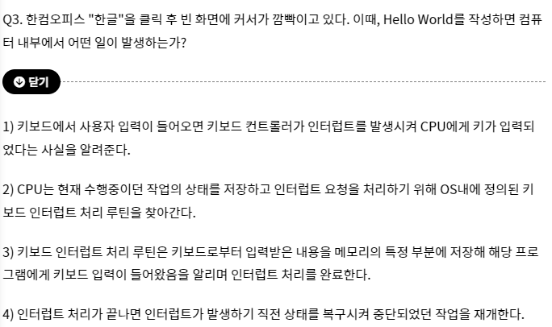

## 설명

### 인터럽트란

프로세스 실행 중에 예외상황이 발생하여 처리가 필요한 경우 CPU에게 알려 처리할 수 있도록 하는 것

- 외부 인터럽트 : 외부 요인, 기계 이상 등
- 내부 인터럽트 :잘못된 명령, zero division, overflow, 명령어 오류
- 소프트웨어 인터럽트(트랩) : 사용자가 프로그램을 실행시킬 때 발생.

### 인터럽트 시스템 콜(소프트웨어 인터럽트)의 차이

시스템 콜이나 예외 상황은 모두 CPU제어권이 사용자 프로세스에서 운영체제로 넘어가 처리된다는 공통점이 있으며, 이 과정에서 인터럽트를 발생시킨 후 제어권이 넘어가게 됨으로 넓은 의미에서는 인터럽트에 속한다. 다만

인터럽트를 발생시키는 주체가 하드웨어 장치 —> 하드웨어 인터럽트

소프트웨어 일 경우 —> 소프트웨어 인터럽트

### 인터럽트와 트랩의 차이점

인터럽트는 하드웨어적 흐름의 변화, 프로그램의 외부(I/O 장치, 디스크 등)에서 발생, 발생 시점이 일정하지 않아 비동기적이다.

트랩은 소프트웨어적 흐름의 변화, 프로그램 내부에서 일어나는 에러로 발생 시점이 프로그램의 일정한 지점이기 때문에 동기적이다 == 고정된 영역에서 일어난다.

// 트랩 : 어떤 프로세스가 특정 시스템 기능을 사용하려고 할 때 그 기능을 운영체제에게 요청하는 방법

예시

- 인터럽트 기능이 없었다면 컨트롤러는 특정한 일을 할 시기를 알기 위해 계속 체크를 해야 하고 이를 폴링 이라고 한다.

- 폴링 : 일정한 주기(특정한 시간)을 가지고 서버와 응답을 주고 받는 방식
    - 서버와 응답을 주고 받는 이유는 웹이 실시간을 위해 지속적인 연결이 불가능하다.
    - 클라이언트가 서버에 특정 요청을 하면 서버가 응답해준 후 연결이 끊어지는게 HTTP의 특징

컨트롤러가 입력을 받아들이는 방법(우선순위 판별방법)

- 폴링 방식
    - 사용자가 명령어를 사용해 값을 계속 읽어 변화를 알아내는 방식
    - 인터럽트 요청 플래그를 차례로 비교하여 우선순위가 가장 높은 인터럽트 서비스 루틴을 수행한다.
- 인터럽트 방식
    - MCU 자체가 하드웨적으로 변화를 체크해 변화시에만 일정한 동작을 하는 방식

### 폴링, 인터럽트 비교

폴링이 대상을 주기적으로 감시하여 상황이 발생하면 해당처리 루틴을 실행해 처리한다면,

인터럽트는 상대가 마이크로프로세서에게 일을 처리해달라고 요청하는 수단

---

인터럽트 방식은 하드웨어로 지원을 받아야 하는 제약이 있지만 폴링에 비해 신속하게 대응하는 것이 가능하다.

실시간 대응이 필요할 때는 필수적인 기능이다.
