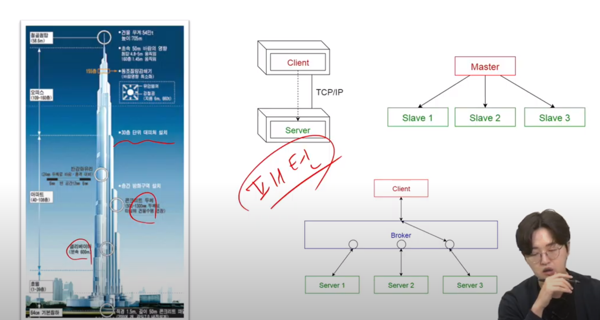

# 시스템 아키텍처

SW 아키텍처 : 소프트웨어 구성요소들 사이에서 유기적 관계를 표현하고, 소프트웨어의 설계와 업그레이드를 통제하는 **지침과 원칙**이다

### 어떻게 사용되는가?

1. 초기 설계 과정의 **결정 사항**
    1. 구현에 대한 제약사항 검토 및 시스템에 대한 구조 결정
2. 커뮤니케이션의 **기준점**
    1. 서비스나 시스템의 이해 당사자들 간의 공통분모
3. 재사용 가능한 **레퍼런스**
    1. 아키텍처를 결정 짓게 한, 유사한 요구사항 및 설계 경험의 재사용
    

### SSAFY 요구 조건

- 구현 방법에 대한 고도화 전략 수립 및 검토
- Sequence 등 상세 구현 방법 결정 및 도식화의 근거자료
- 팀내 의사결정 내용 Synchronized
- 레퍼런스 축적

## 예시로 보는 아키텍처 설계 방법

### 학사 관리 시스템을 통한 아키텍처 설계방법

결정요인 도출

1. 이해관계자 선별
    1. 시스템과 연관되는 사람이나 다른 시스템(학생, 교수, 교직원, 외부 시스템)
2. 기능 요구사항
    1. 학사 관리 기능, 수업 관리 기능, 수강 관리 기능, 사용자 관리 기능
3. 비기능 요구사항(품질속성)
    1. 강의 신청 기간에 원활한 진행, 언제 어디서나 접근 가능, 모바일에서도 접근 가능, 권한을 통한 정보 보안, 데이터 손실 방지

# 품질 속성을 만족시키기 위한 전략

### 패턴 학습

### 품질 속성 시나리오 & 비기능 요구사항

- 스파이크 성 트래픽에 대한 처리, public 환경, 하이브리드 앱

- 권한을 통한 정보 보안, 주기적 데이터 백업

### 아키텍처 도식화

# 정리

### 아키텍처 그리기 순서

비기능 요구사항 도출 → 품질속성 시나리오 작성 → 아키텍처 패턴 결정 → 아키텍처 도식화

### 팁

- 품질속성을 정확히 정의
- 품질속성 별로 전략 도출
- 도출된 전략을 잘 보여 줄 수 있게 도식화
- 아키텍처 검증(평가)

