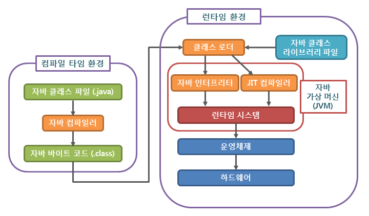

### 우리가 공부하는 블로그에서는...

자바는 OS에 독립적인 특징을 가지고 있다. 그게 가능한 이유는 JVM(Java Vitual Machine) 덕분이다. 그렇다면 JVM(Java Vitual Machine)의 어떠한 기능 때문에, OS에 독립적으로 실행시킬 수 있는지 자바 컴파일 과정을 통해 알아보도록 하자.

# 자바 컴파일 순서

1. 개발자가 자바 소스코드(.java)를 작성합니다.

2. 자바 컴파일러(Java Compiler)가 자바 소스파일을 컴파일합니다.  
   이때 나오는 파일은 자바 바이트 코드(.class)파일로 아직 컴퓨터가 읽을 수 없는, 자바 가상 머신이 이해할 수 있는 코드입니다.  
   바이트 코드의 각 명령어는 1바이트 크기의 Opcode(명령코드)와 추가 피연산자로 이루어져 있습니다.

3. 컴파일된 바이트 코드를 JVM의 클래스로더(Class Loader)에게 전달합니다.

4. **클래스 로더**는 동적로딩(Dynamic Loading)을 통해 필요한 클래스들을 로딩 및 링크하여 런타임 데이터 영역(Runtime Data area), 즉 JVM의 메모리에 올립니다.

### 👉 클래스 로더 세부 동작

> 1. 로드 : 클래스 파일을 가져와서 JVM의 메모리에 로드합니다.

> 2. 검증 : 자바 언어 명세(Java Language Specification) 및 JVM 명세에 명시된 대로 구성되어 있는지 검사합니다.

> 3. 준비 : 클래스가 필요로 하는 메모리를 할당합니다. (필드, 메서드, 인터페이스 등등)

> 4. 분석 : 클래스의 상수 풀 내 모든 심볼릭 레퍼런스를 다이렉트 레퍼런스로 변경합니다.

> 5. 초기화 : 클래스 변수들을 적절한 값으로 초기화합니다. (static 필드)

5. 실행엔진(Execution Engine)은 JVM 메모리에 올라온 바이트 코드들을 명령어 단위로 하나씩 가져와서 실행합니다. 이때, 실행 엔진은 두가지 방식으로 변경합니다.

## 컴파일러와 인터프리터

> 자바 코드를 실행하기 위해서는 아래와 같은 과정이 필요하다.

1. 자바 파일(.java)을 자바 컴파일러(javac)를 통해 바이트코드 파일(.class)로 컴파일한다.  
   즉, 자바 컴파일러는 자바 소스코드를 JVM을 위한 기계어로 변환한다.
2. JVM의 실행 엔진 내에 있는 자바 인터프리터를 통해 바이트코드를 특정 환경의 기계어로 번역하고 실행한다.

### 자바는 왜 자바 컴파일러를 사용할까?

자바는 WORA(Write once, run anywhere)를 구현하기 위해 물리적인 머신과 별개의 가상 머신(JVM)을 기반으로 동작하도록 설계되었다.  
 그래서 자바 바이트코드를 실행하고자 하는 모든 하드웨어에 JVM을 동작시킴으로써 자바 실행 코드를 변경하지 않고도 모든 종류의 하드웨어에서 동작되게 한 것이다.  
 Java 소스코드, 즉 원시코드(.java)는 CPU가 인식을 하지 못하므로 기계어로 컴파일을 해줘야 한다.  
 하지만 Java는 이 JVM이라는 가상 머신을 거쳐서 OS에 도달하기 때문에 OS가 인식할 수 있는 기계어로 바로 컴파일되는 게 아니라 JVM이 인식할 수 있는 자바 바이트코드(.class)로 변환된다.  
 자바 컴파일러가 .java 파일을 .class 파일인 자바 바이트코드로 변환한다.

### JVM의 실행 엔진은 왜 인터프리터를 사용할까?

1. **인터프리터는 플랫폼에 종속되지 않는다.**  
   바로 기계어로 변환하는 컴파일러의 경우는 프로그램이 작성된 기계상에서 매우 효율적으로 실행된다.  
   이는 대부분의 하드웨어 제어 시스템의 프로그래밍 언어가 C인 이유이다. 그러나 이와 동시에 기계에 종속된다는 말이기도 하다.  
   자바 인터프리터은 자바 컴파일러를 통해 생성된 바이트코드를 한 줄씩 읽어 기계어로 번역하고 실행한다.  
   따라서 이는 WORA를 구현하고자 하는 자바의 철학과 맞닿아있다. 만약 JVM 내에서 컴파일러를 사용하여 바이트코드의 목적 파일을 생성한다면 이는 기계에 종속되는 파일이기 때문이다.  
   (하지만 이와 모순되게 인터프리터는 컴파일러보다 실행 속도가 너무 느리기 때문에 이를 해결하고자 JVM은 부분적으로 JIT 컴파일러를 사용하여 바이트코드를 컴파일하여 사용한다.)

2. **초기 실행 속도를 빠르게 할 수 있다.**  
   자바 바이트코드 전체를 프로그램 수행 초기에 모두 읽어 컴파일하게 되면 초기 실행 속도가 느리다. 인터프리터를 사용하면 초기 실행 속도를 높일 수 있다.

3. **보안적으로 장점이 있다.**
   자바 바이트코드는 컴퓨터와 프로그램 사이에 별도의 버퍼 역할을 한다. 인터넷이나 기타 매체를 통해 신뢰할 수 없는 프로그램을 다운로드하여 실행하는 경우 어느 정도 안전이 보장될 수 있다. 자바 인터프리터를 사용함으로써 바이러스나 기타 악성 프로그램에 대응하는 가드 같은 보안 계층에 의해 보호될 수 있다.

인터프리터 : 바이트 코드 명령어를 하나씩 읽어서 해석하고 실행합니다. 하나하나의 실행은 빠르나, 전체적인 실행 속도가 느리다는 단점을 가집니다.

## 💁 JIT 컴파일러(Just-In-Time Compiler) :

인터프리터의 단점을 보완하기 위해 도입된 방식으로 바이트 코드 전체를 컴파일하여 바이너리 코드로 변경하고 이후에는 해당 메서드를 더이상 인터프리팅 하지 않고, 바이너리 코드로 직접 실행하는 방식이다.  
 하나씩 인터프리팅하여 실행하는 것이 아니라 바이트 코드 전체가 컴파일된 바이너리 코드를 실행하는 것이기 때문에 전체적인 실행속도는 인터프리팅 방식보다 빠르다.
