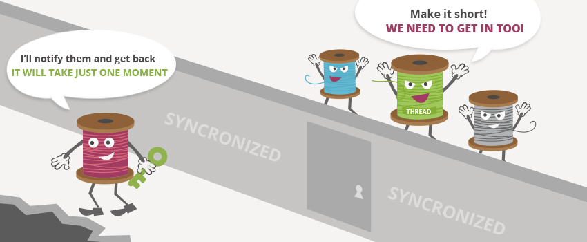

# Thread란?

- 프로세스를 구성하는 '제어의 흐름'

## 1. Process와 Thread

1. Process : 실행 단위
2. Process를 구성하는 작업 단위

## 2. Thread의 장점

> '가벼운 프로세스(LWP, Light Weight Process)' 라고도 불리며, 이유는 프로세스의 공통 자원을 공유하기 때문이다.

## 3. Java에서 Thread 생성 방법

1. Thread

```java
  public class Model1 extends Thread {
    public void run(){
        System.out.println("extends Thread")
      }
  }
```

2. Runnable

```java
  public class Model2 implements Runnable {
    public void run(){
        System.out.println("implements Runnable")
      }
  }
```

> Thread를 상속받는 경우에는 **start() 메서드**를 호출, 하지만 Runnable 인터페이스를 구현한 경우에는 **Runnable 인터페이스를 매개변수로 받는 생성자로 Thread 클래스를 만든 후 start()를 호출해야 한다.**

- 간편한 것은 전자이지만, 확장성이 넓은 것은 후자이다.  
  [참고](https://aileen93.tistory.com/105)

## 4. 동기화 (Synchronized)란?

> 하나 이상의 Thread가 어떤 로직에 동시에 접근했을 때, 그 연산에 대한 값의 무결성을 보장하기 위해 수행 영역에 대한 lock을 걸어주는 것.

### Thread-Safe란?

- Multi Thread 프로그래밍에서 여러 Thread로부터  
  어떤 method나, variable, object에  
  동시에 접근이 이뤄져도  
  프로그램의 실행에 문제가 없음!

- 하나의 function이 한 Thread로 부터 호출되어 실행 중일 때,  
  다른 Thread가 동일한 함수를 호출하여 동시에 실행되더라도  
  각 Thread에서 함수의 수행 결과가 바르게 나오는 것!

<hr>

## 👉 참고자료

- [Thread-safe는 혼자 열심히 한다고 해결되지 않는다.](https://jeong-pro.tistory.com/227)
- [StringBuilder와 StringBuffer의 사용차이](https://jeong-pro.tistory.com/85)  
  -> StringBuilder의 성능이 더 좋지만 Thread-safe한 것은 StringBuffer
- [int자료형을 Thread-safe하게 하려면](https://codechacha.com/ko/java-atomic-integer/)
