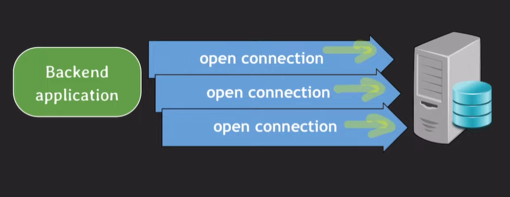

# Call by Reference, Call by Value 차이

### Call by Value : 함수를 호출하면서 매개변수에 값을 전달하는 방식

### Call by Reference : 참조에 의한 호출

## Call by Value

```java
public class CallByValue{
    public static void swap(int x, int y){
        int temp = x;
        x = y;
        y = temp;
    }

    public static void main(String[] args){
        int a = 10;
        int b = 20;

        System.out.println("swap() 호출 전 : a = " + a + ", b = " + b);

        swap(a, b);
        System.out.println("swap() 호출 후 : a = " + a + ", b = " + b);
    }
}
temp = a
x = b
y = a
swap() 호출 전 : a = 10, b = 20
swap() 호출 후 : a = 10, b = 20
```


### 메서드 호출 시에 사용되는 인자의 메모리에 저장되어 있는 값(value)를 복사하여 보낸다.

## Call by Reference

```java
public class CallByReference{
    int value;

    CallByReference(int value){
        this.value = value;
    }

    public static void swap(CallByReference x, CallByReference y){
        int temp = x.value;
        x.value = y.value;
        y.value = temp;
    }

    public static void main(String[] args){
        CallByReference a = new CallByReference(10);
        CallByReference b = new CallByReference(20);

        System.out.println("swap() 호출 전 : a = " + a.value + ", b = " + b.value);
        
        swap(a, b);

        System.out.println("swap() 호출 후 : a = " + a.value + ", b = " + b.value);
    }
}

swap() 호출 전 : a = 10, b = 20
swap() 호출 후 : a = 20, b = 10
```



### 주소 값을 복사하여 연산한다. → 연산 결과에 따라 원본 데이터가 변하게 된다.

### 메서드 호출 시 사용되는 인자 값의 메모리에 저장되어 있는 주소(Address)를 복사하여 보낸다.
