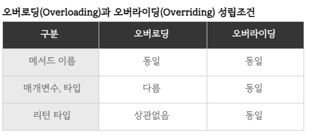

### 오버라이딩

: 상속 관계일 때, 상위 클래스가 가지고 있는 메소드를 하위 클래스에서 재정의 해서 사용하는 기법.

### 오버로딩

: 한 클래스 내에서 같은 이름의 메소드를 여러 개 가지며 매개 변수 유형과 갯수 다르게 사용하는 기법

### 오버라이딩과 오버로딩은 메소드(기능)의 재정의 또는 확장을 위한 개념, 어디에서 어떤 용도로 사용 하느냐의 차이이다.

