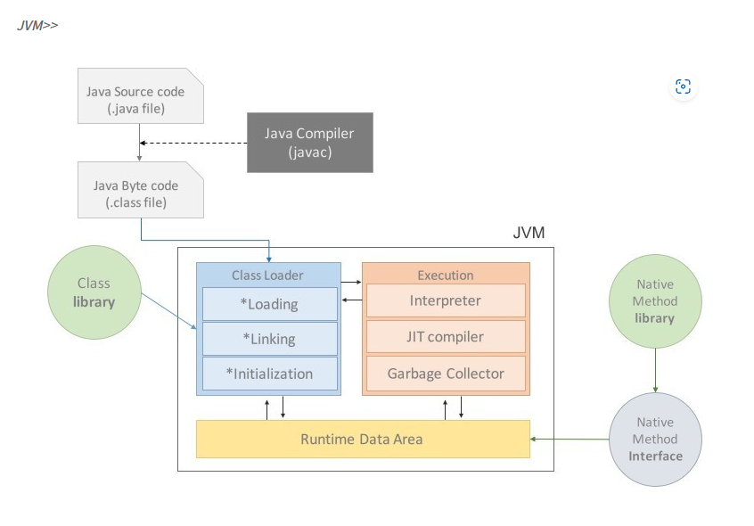
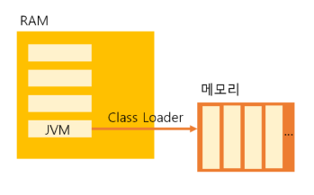
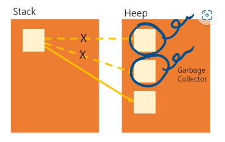
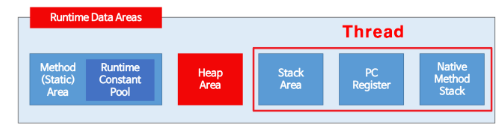
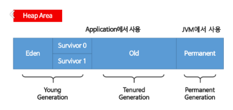

> CS Git 업로드용

# JVM이란?

> 자바 가상 머신 JVM(Java Virtual Machine)은 자바 프로그램 실행환경을 만들어 주는 소프트웨어입니다.  
>  자바 코드를 컴파일하여 .class 바이트 코드로 만들면 이 코드가 자바 가상 머신 환경에서 실행됩니다.  
>  JVM은 자바 실행 환경 JRE(Java Runtime Environment)에 포함되어 있습니다.  
>  현재 사용하는 컴퓨터의 운영체제에 맞는 자바 실행환경 (JRE)가 설치되어 있다면 자바 가상 머신이 설치되어 있다는 뜻입니다.

## 자바프로그램 실행과정

1. 프로그램이 실행되면 JVM은 OS로부터 이 프로그램이 필요로 하는 메모리를 할당받는다.  
   JVM은 이 메모리를 용도에 따라 여러 영역으로 나누어 관리한다.
2. 자바 컴파일러(javac)가 자바 소스코드(.java)를 읽어들여 자바 바이트코드(.class)로 변환시킨다.  
   (.class 파일은 바이트 코드라고 하는데 사람이 쓰는 자바 코드에서 컴퓨터가 읽는 기계어로의 중간 단계라고 생각하시면 됩니다.)
3. Class Loader를 통해 class파일들을 JVM으로 로딩한다.  
   로딩된 class파일들은 Execution engine을 통해 해석된다.  
   해석된 바이트코드는 Runtime Data Areas 에 배치되어 실질적인 수행이 이루어지게 된다.  
   이러한 실행과정 속에서 JVM은 필요에 따라 Thread Synchronization과 GC(가비지 컬렉터)같은 관리작업을 수행한다.

 

## JVM 구성

> 용어에 대한 설명은 구글링을 통해 한땀한땀 Assemble 했습니다 😭

### Class Loader(클래스 로더)

> 자바는 동적으로 클래스를 읽어오므로, 프로그램이 실행 중인 런타임에서야 모든 코드가 자바 가상 머신과 연결됩니다.  
>  이렇게 동적으로 클래스를 로딩해주는 역할을 하는 것이 바로 클래스 로더(class loader)입니다.  
>  자바에서 소스를 작성하면 .java파일이 생성되고 .java소스를 컴파일러가 컴파일하면 .class파일이 생성되는데 클래스 로더는 .class 파일을 묶어서 JVM이 운영체제로부터 할당받은 메모리 영역인 Runtime Data Area로 적재합니다.

### Execution Engine(실행 엔진)

> 클래스 로더에 의해 JVM으로 로드된 .class 파일(바이트코드)들은 Runtime Data Areas의 Method Area에 배치되는데, 배치된 이후에 JVM은 Method Area의 바이트 코드를 실행 엔진(Execution Engine)에 제공하여(?), 정의된 내용대로 바이트 코드를 실행시킵니다.  
>  이때, 로드된 바이트코드를 실행하는 런타임 모듈이 실행 엔진(Execution Engine)입니다. 실행 엔진은 바이트코드를 명령어 단위로 읽어서 실행합니다.

### Interpreter(인터프리터)

> 실행 엔진은 자바 바이트 코드를 명령어 단위로 읽어서 실행한다. 하지만 이 방식은 인터프리터 언어의 단점을 그대로 갖고 있다. 한 줄 씩 수행하기 때문에 느리다는 것이다.

### JIT(Just - In - Time)

> 인터프리터 방식의 단점을 보완하기 위해 도입된 JIT 컴파일러이다. 인터프리터 방식으로 실행하다가 적절한 시점에 바이트 코드 전체를 컴파일하여 네이티브 코드로 변경하고, 이후에는 더 이상 인터프리팅 하지 않고 네이티브 코드로 직접 실행하는 방식이다.  
>  네이티브 코드는 캐시에 보관하기 때문에 한 번 컴파일된 코드는 빠르게 수행하게 된다. 물론 JIT컴파일러가 컴파일하는 과정은 바이트코드를 인터프리팅하는 것 보다 훨씬 오래걸림으로 한 번만 실행되는 코드라면 컴파일하지 않고 인터프리팅 하는 것이 유리하다.  
>  따라서 JIT 컴파일러를 사용하는 JVM들은 내부적으로 해당 메서드가 얼마나 자주 수행되는지 체크하고, 일정 정도를 넘을 때에만 컴파일을 수행한다.

 

> 네이티브 코드란, JAVA에서 부모가 되는 C언어나, C++, 어셈블리어로 구성된 코드를 의미한다.

### Garbage Collector

> 자바 가상 머신은 가비지 컬렉터(garbage collector)를 이용하여 더는 사용하지 않는 메모리를 자동으로 회수해 줍니다.  
>  따라서 개발자가 따로 메모리를 관리하지 않아도 되므로, 더욱 손쉽게 프로그래밍을 할 수 있도록 도와줍니다.  
>  Heap 메모리 영역에 생성(적재)된 객체들 중에 참조되지 않은 객체들을 탐색 후 제거하는 역할을 하며 해당 역할을 하는 시간은 정확히 언제인지를 알 수 없습니다.  
>  GC역할을 수행하는 스레드를 제외한 나머지 모든 스레드들은 일시정지상태가 됩니다.

## 런타임 데이터 영역 (Runtime Data Area)

> 런타임 데이터 영역은 JVM의 메모리 영역으로 자바 애플리케이션을 실행할 때 사용되는 데이터들을 적재하는 영역입니다.

**1. 모든 스레드가 공유해서 사용 (GC의 대상)**

- 힙 영역 (Heap Area)
- 메서드 영역(Method Area)

**2. 스레드(Thread) 마다 하나씩 생성**

- 스택 영역(Stack Area)
- PC 레지스터 (PC Register)
- 네이티브 메서드 스택(Native Method Stack)

**3. 메서드 영역 (Method Area = Class Area = Static Area)**

> 클래스 멤버 변수의 이름, 데이터 타입, 접근 제어자 정보와 같은 각종 필드 정보들과 메서드 정보, 데이터 Type 정보, Constant Pool, static변수, final class 등이 생성되는 영역입니다.

**4. 힙 영역 (Heap Area)**

1. new 키워드로 생성된 객체와 배열이 생성되는 영역입니다.
2. 주기적으로 GC가 제거하는 영역입니다.

> Heap Area는 효율적인 GC를 위해 위와 같이 크게 3가지의 영역으로 나뉘게 됩니다.

- Young Generation 영역은 자바 객체가 생성되자마자 저장되고, 생긴지 얼마 안되는 객체가 저장되는 공간입니다.  
  Heap 영역에 객체가 생성되면 최초로 Eden 영역에 할당됩니다.  
  그리고 이 영역에 데이터가 어느정도 쌓이게 되면 참조정도에 따라 Servivor의 빈 공간으로 이동되거나 회수됩니다.

- Young Generation(Eden+Servivor) 영역이 차게 되면 또 참조정도에 따라 Old영역으로 이동 되게 되거나 회수됩니다.  
  이렇게 Young Generation과 Tenured Generation 에서의 GC를 Minor GC 라고 합니다.  
  Old영역에 할당된 메모리가 허용치를 넘게 되면, Old 영역에 있는 모든 객체들을 검사하여 참조되지 않는 객체들을 한꺼번에 삭제하는 GC가 실행됩니다.  
  시간이 오래 걸리는 작업이고 이 때 GC를 실행하는 쓰레드를 제외한 모든 스레드는 작업을 멈추게 됩니다.  
  이를 'Stop-the-World' 라 합니다. 그리고 이렇게 'Stop-the-World'가 발생하고 Old영역의 메모리를 회수하는 GC를 Major GC라고 합니다.

**5. 스택 영역 (Stack Area)**

> 지역변수, 파라미터, 리턴 값, 연산에 사용되는 임시 값 등이 생성되는 영역입니다.

**6. PC 레지스터 (PC Register)**

> Thread가 생성될 때마다 생성되는 영역으로 프로그램 카운터, 즉 현재 스레드가 실행되는 부분의 주소와 명령을 저장하고 있는 영역입니다.

**7. 네이티브 메서드 스택 (Native Method Stack)**

1. 자바 이외의 언어(C, C++, 어셈블리 등)로 작성된 네이티브 코드를 실행할 때 사용되는 메모리 영역으로 일반적인 C 스택을 사용합니다.

2. 보통 C/C++ 등의 코드를 수행하기 위한 스택을 말하며 (JNI) 자바 컴파일러에 의해 변환된 자바 바이트 코드를 읽고 해석하는 역할을 하는 것이 자바 인터프리터(interpreter)입니다.
