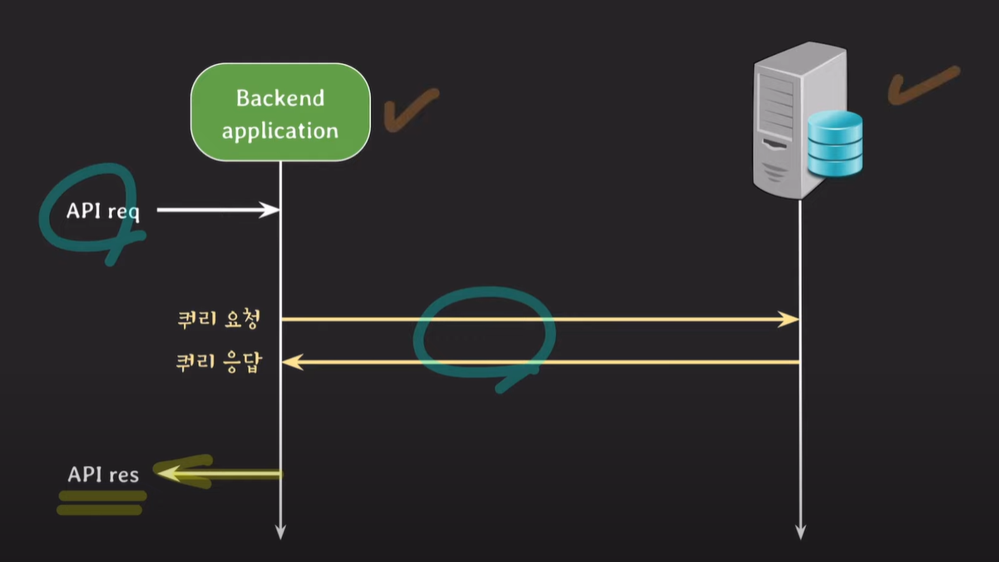
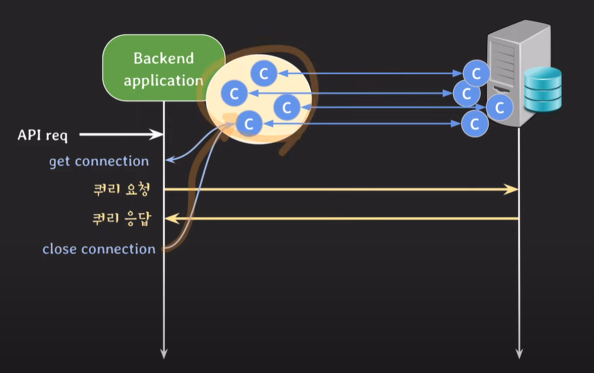

- 이 쿼리 요청과 응답은 보통 다른 컴퓨터 사이에서 일어난다-> 결국 두 컴퓨터 사이 네트워크 통신을 하게 됨
- 백엔드 서버와 DB 서버는 TCP 기반으로 동작하게 된다
- 근데 이 TCP는 연결지향적이라 

    이렇게 연결을 해주고(3-way handshake) 연결을 끊어주는(4-way handshake) 과정이 필요하다 
- 근데 백엔드 서버 관점에선 매번 이렇게 db서버에 connection을 열고 닫고 하는 게 시간이 너무 오래걸린단 말이지  
 
 

- 그래서 나온게 DBCP
- 일단 api 요청 받기 전에 connection을 만들어놓고 
    이걸 pool처럼 관리한다
- api request가 들어오면 놀고 있는 connection 하나 들고와서 쿼리를 보낸다

- close connection을 할 때 실제로 connection을 종료시키는 게 아니라 다시 pool에 반납하는 것!!
- connection을 재사용하는 거니까 열고 닫는 시간이 절약된다 
 
 

## DBCP: database connection pool 
 
 

- 트래픽이 몰리면 connection이 나갔다 들어왔다 엄청 바쁘게 움직인
- 백엔드 서버 자체의 메모리 사용량, cpu 사용량이 엄청 늘어나서 과부화가 와서 
    안되겠다 다른 서버 투입하자 하고 connection을 맺을라고 봤는데
 
 

- 이미 max_connections가 차 있어서 연결할 수가 없는거임ㅠㅠ 
    그래서 max_connections 라는 매개변수가 중요하게 작동한다

- wait_timeout이라는 매개변수는  
    - 비정상적인 connection 종료거나
    - connection 쓰고 반환이 안되거나
    - 네트워크가 단절되면 
- 백엔드 서버가 connection을 쓰고 있지 않는데도 db서버에 반환이 안된 상태가 될 수 있음 
- 근데 이런 connection이 많아지면 db서버의 리소스를 차지하게 되고 나중에 안좋은 영향을 미칠 수도 있다
- 그래서 wait_timeout을 설정해서 뭐 만약에 60초라고 설정하게 되면 60초 지나도 요청이 오지 않았을 때 db서버에서 연결을 끊어버린다 
- 하지만 시간 내에 요청이 도착하면 0으로 초기화하고 시간을 카운트 한다

 
 

---

 
 

# DBCP 설정