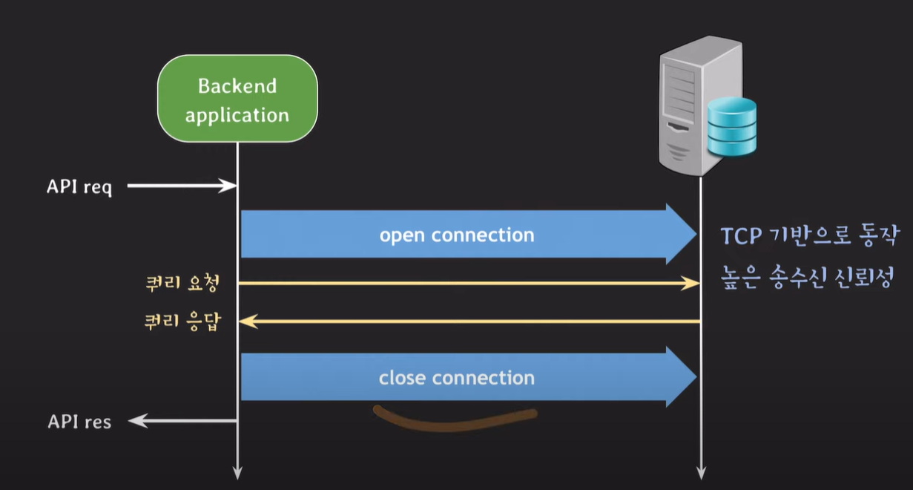
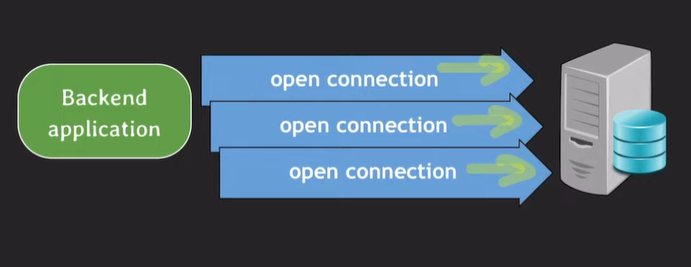

- 이 쿼리 요청과 응답은 보통 다른 컴퓨터 사이에서 일어난다-> 결국 두 컴퓨터 사이 네트워크 통신을 하게 됨
- 백엔드 서버와 DB 서버는 TCP 기반으로 동작하게 된다
- 근데 이 TCP는 연결지향적이라 

    이렇게 연결을 해주고(3-way handshake) 연결을 끊어주는(4-way handshake) 과정이 필요하다 
- 근데 백엔드 서버 관점에선 매번 이렇게 db서버에 connection을 열고 닫고 하는 게 시간이 너무 오래걸린단 말이지  
 
 

- 그래서 나온게 DBCP
- 일단 api 요청 받기 전에 connection을 만들어놓고 
    이걸 pool처럼 관리한다
- api request가 들어오면 놀고 있는 connection 하나 들고와서 쿼리를 보낸다

- close connection을 할 때 실제로 connection을 종료시키는 게 아니라 다시 pool에 반납하는 것!!
- connection을 재사용하는 거니까 열고 닫는 시간이 절약된다 
 
 

## DBCP: database connection pool 
 
 

- 트래픽이 몰리면 connection이 나갔다 들어왔다 엄청 바쁘게 움직인
- 백엔드 서버 자체의 메모리 사용량, cpu 사용량이 엄청 늘어나서 과부화가 와서 
    안되겠다 다른 서버 투입하자 하고 connection을 맺을라고 봤는데
 
 

- 이미 max_connections가 차 있어서 연결할 수가 없는거임ㅠㅠ 
    그래서 max_connections 라는 매개변수가 중요하게 작동한다

- wait_timeout이라는 매개변수는  
    - 비정상적인 connection 종료거나
    - connection 쓰고 반환이 안되거나
    - 네트워크가 단절되면 
- 백엔드 서버가 connection을 쓰고 있지 않는데도 db서버에 반환이 안된 상태가 될 수 있음 
- 근데 이런 connection이 많아지면 db서버의 리소스를 차지하게 되고 나중에 안좋은 영향을 미칠 수도 있다
- 그래서 wait_timeout을 설정해서 뭐 만약에 60초라고 설정하게 되면 60초 지나도 요청이 오지 않았을 때 db서버에서 연결을 끊어버린다 
- 하지만 시간 내에 요청이 도착하면 0으로 초기화하고 시간을 카운트 한다

 
 

---

 
 

# DBCP 설정
- minimumIdle: 연결은 되어있지만 요청을 기다리고 있는 idle상태인 connection 

- 만약 minimumIdle이 maximumPoolSize보다 작을 때

    트래픽이 밀려온다면 dbcp가 새로운 connection을 만든다 
    언제까지? maximumPoolSize까지!!
- maximumPoolSize이 minumumIdle보다 우선순위가 높기 때문에

- 그리고 트래픽이 감소하게되면 minimumIdle대로 connection 2개를 끊어버린다 
- 근데 minimumIdle 사이즈는 maximumPoolSize와 동일하게 만드는 게 권장한다
(트래픽 없다고 끊어버리면 다시 트래픽 몰릴 때마다 다시 connection을 이어줘야 하니까 시간이 낭비되기 때문)

- db서버의 wait_timeout이 지나면 connection이 끊겨서 다시 요청을 보내더라도 반환값이 돌아오지 않음 
-> 그렇기 때문에 pool로 반환을 잘 시켜주는 것이 중요하다!!
- db의 connection time limit(db의 wait_timeout)보다 몇 초 짧게 설정해야 한다

- 왜냐면 59초 쯤에 요청이 들어와서 db로 쿼리를 보내는데 중간쯤 와서 60가 되어버리면 connection이 끊어져버리고 요청이 정상적으로 처리가 되지 않아서 Exception이 발생할 수 있기 때문 

- 트래픽이 밀려와서 connection을 다 쓴 상황일 때 무한정 connection 자리가 나길 기다릴 수 없으니까 connectionTimeout을 설정 
-> 설정해둔 30초가 지나면 Exception 발생시킨다   
- 근데 일반적인 사용자라면 30초까지도 안기다려-> 그럼 29초까지 기다렸다가 db접근해서 데이터 받아오는 게 의미가 없어(클라이언트 쪽에서 벌써 연결을 끊어버렸으니까) 
=> 적절하게 시간을 설정해주는 것이 중요함 

 
 

# 적절한 connection 수

- 부하테스트를 진행 
    트래픽을 늘려가면서 잘 동작하는지를 관찰

- 어느 순간부터는 처리할 수 있는 request가 고정될거고 
    시간은 늘어나게 된다, 즉 성능이 안좋아 진다는 거
- 그 지점에!! 모니터링 지표들을 확인해본다 
- 백엔드 서버의 메모리 사용량이 60-70%가 된다면 서버를 추가해야 하는 거고(더이상 서버가 감당하지 못한다는 뜻이니까) 
메모리 사용량은 괜찮은데 db서버 리소스 사용량이 늘어난다면 secondary server를 추가하거나 백엔드 서버와 db서버 사이 cache layer를 추가하거나 등등..
- 둘다 괜찮을 땐
    - thread per request 모델이라면 active thread 수를 확인 
        thread pool의 thread count를 늘려주거나 
        근데 thread pool은 100갠데 activate thread가 50개야
    - 그럼 dbcp의 active connection 수를 확인할 듯 
