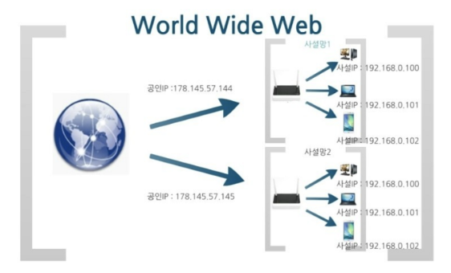
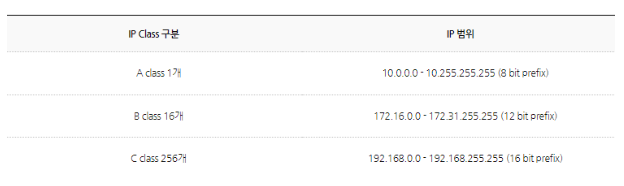
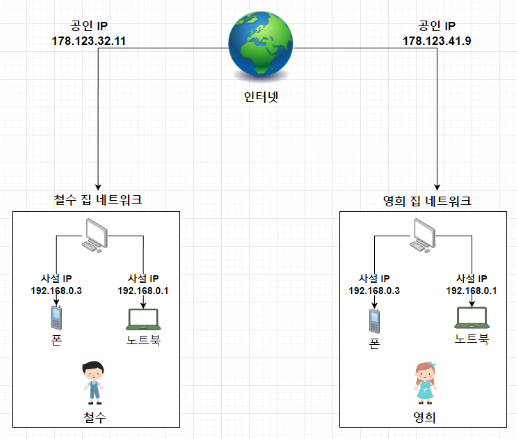

- IPv4는 255^4 = 43억 개만큼 사용이 가능함
- 전세계가 발전하면서 전자기기가 점점 많아지다 보니 IPv4 주소가 부족한 문제가 생김
- IPv4 문제점을 보완해서 IPv6가 나오긴 했지만 기존의 주소체계에서 IPv6로 변경하자니 비용이 너무 많이 든다!
- IPv4 주소 부족의 문제를 해결하기 위한 방법으로 나온 것이 사설IP(private IP)
 
 

# 공인IP
- 공용IP, 외부에 공개되어 있는 IP
- 외부에 공개되어 있기 때문에 인터넷에 연결된 다른 PC로부터 접근 가능
-> 방화벽 등을 설치해서 내부망에 있는 컴퓨터만 접근 가능하게 한다던지
  보안 프로그램을 설치해야 안전
 
 

## 공인IP를 발급받아 우리가 인터넷을 사용하는 과정
- 전세계적으로 ICANN이라는 기관이 국가별로 사용할 IP 대역을 관리 
- 우리나라가 사용할 수 있는 IP를 KISA(인터넷진흥원)에서 받고 주소를 관리한다 
  (따라서, 임의로 아무 IP 주소나 접속한다고 인터넷이 되는 것이 아니라 할당 받은 주소를 부여해야만 인터넷에 접속할 수 있다)
- KISA에서 관리하는 IP주소를 ISP(인터넷 서비스 공급자: KT, LG, SKT와 같은 통신업체)가 부여 받는다
- 우리가 그 통신사들 중 하나에 가입해 IP를 제공받아 인터넷을 사용한다
 
 

# 사설IP
- 제한적인 공인IP에 사설망을 구성해 각기 다른 주소로 할당할 수 있도록 만들어졌다(일반 가정이나 회사 내 등 사용할 목적으로 만들어진 IP주소)
- 외부에서 직접 접근할 수 없어 보안이 용이  

- 사설IP 주소만으로는 인터넷에 직접 연결할 수 없다
- 라우터를 통해 1개의 공인IP만 할당하고 라우터에 연결된 개인PC는 사설IP를 각각 할당받아 인터넷에 접속할 수 있게 된다
- 공유기를 사용한 인터넷 접속 환경일 경우 공유기까지는 공인IP 할당을 하지만 공유기에 연결되어 있는 가정이나 회사의 각 네트워크 기기에는 사설IP를 할당한다
- 사설IP 주소는 다음 3가지 주소대역으로 고정되어 있고, class B, class C를 주로 사용한다

- 그러니까, 같은 내부망에 있는 컴퓨터는 서버에 있는 svn에 192.168.100.100을 입력하고 들어갈 수 있으나 다른 사설IP를 사용하고 있는 컴퓨터는 svn에 접근할 수 없다는 뜻

- 철수의 노트북이 사용하는 IP와 영희의 노트북이 사용하는 IP는 같지만 각기 다른 공인 IP로 구성된사설망 안에서 내부적으로 사용되는 고유한 IP이기 때문에 겹쳐도 상관 없다
- 즉, 사설망이라는 개념을 통해 IP번호를 중복해서 사용할 수 있으며 IPv4의 주소절약이 가능하다
- 공인IP는 전세계에서 유일하지만 사설IP는 하나의 네트워크 안에서 유일
- 공인IP는 외부, 내부 상관없이 해당 IP에 접속할 수 있으나 사설IP는 내부에서만 접근 가능하다 
 
 

---
 
 

# 고정IP
- 컴퓨터에 고정적으로 부여된 공인IP, 한번 부여되면 IP를 반납하기 전까지는 다른 장비에 부여할 수 없는 IP주소
- 인터넷 사이트를 운영할 때 고정IP를 사용하고 이때 고정IP를 사용하지 않으면 외부에 알려진 IP가 자칫 다른 사이트에서 사용할 수 있다
- 예를 들어 내가 254.234.11.12라는 IP를 사용한다고 했을 때 우리만 사용하는 IP가 아니라면 저 IP를 쳤을 때 다른 사이트로 이동할 수도 있다는 거
- 한번 부여되면 IP 반납을 하기 전까지는 다른 장비에 부여할 수 없는 고유의 IP로 보안에 우수-> 보안이 필요한 업체나 기관에서 사용한다
 
 

# 유동IP
- 컴퓨터를 사용할 때 남아있는 IP중 돌아가면서 부여하는 IP를 말한다
- IP갱신주기가 되었을 때 기기를 껐다 키면 ISP(KT같은 인터넷 서비스 공급자)에서 남아있는 IP를 골라 기기에 IP를 할당해줌
- 근데 KT가 제공해줄 수 있는 IP는 유한하다-> 인터넷을 사용하는 기기가 꺼져있는 데도 IP를 할당받고 있으면 IP가 부족할 수 있음
- 그래서 기기가 켜져있을 땐 IP를 유지해주지만 종료하면 IP를 수거해서 다른 사용자에게 재할당해준다
